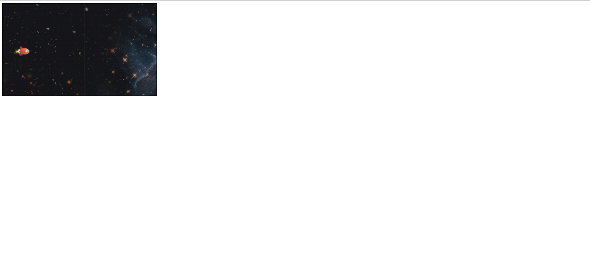
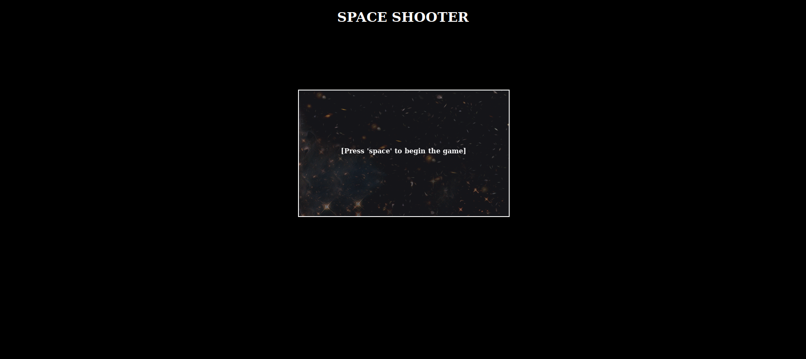

# 		Programmation WEB

## TP 0.1 :

### 	Exercice 1 :

1/ Hello World apparait sur la page après l'apparition de l'alerte. Ce qui est normal car le script est écrit dans l'entête qui est chargé avant le corp.

2/ Alert permet d'afficher un message pour notifier l'utilisateur. 

3/ Parce qu'elle est chargé dans l'entête et que l'entête n'est chargé qu'une fois.

4/ On en déduit qu'on peut définir des fonctions dans l'entête. On voit qu'on peut utiliser "onload" dans les chevrons pour réaliser une action lors du chargement du corp de la page, et que cela permet d'afficher le corp et le message

5/ Si je met 		

```html
<p onload="faireUneAlerte()"> Ceci est un test </p>
```

et que j'enlève le "onload" dans le chargement du corp, il ne charge pas le message d'alerte.

Avec le code donné en annexe pour la q5, on voit qu'on peut appliquer la méthode onload à la fenêtre.

### 	Exercice 2 :	

Quand les variables sont introduites avec "var", alors elles ont une portée locale à la fonction, sinon la portée est globale.

### Exercice 3 :


1/ Ce code va charger le DOM et on va pouvoir modifier l'arbre directement. 

2/ On pourrait attrapper grâce au className grâce à getElementByClassName

3/ pour ajouter du texte dans la division 1 je rajoute le code suivant :

```javascript
		text=document.createElement('p');
		laDiv1.setAttribute('id','text1');
		text.textContent = "Hello World"
		laDiv1.appendChild(text);
```


### 	Exercice 4 :

Ok ça marche !

### 	Exercice 5 :

https://developer.mozilla.org/fr/docs/Web/Guide/DOM/Events/Creating_and_triggering_events

### 	Exercice 6 :

Voir code ! :)

## TP 1 :

### Exercice 4 :

Ici on doit faire 3 carrées qui bougent. On pourrait le faire en recopiant 3 fois le code, mais ce n'est pas très malin. Je propose dons de créer une classe movingSquare qui va avoir en variable un canvas. Ainsi j'aurais juste à lancer 3 movingSquare avec un délais grâce à la commande setInterval.

## TP2 :

L'idée est d'utiliser request Animation au lieu d'utiliser les setInterval pour faire des boucles de jeux.

En introduisant, une fonction pausecomp qui simule le temps de travail pour le traitement d'une image complexe par exemple, en lançant test1.html, on se rend compte que notre carré ne bouge pas de manière fluide.

Pour que l'animation se fassent en temps réel, je calcul le delta de temps entre la dernière fois où le carré à été affiché et le moment actuel et je divise par la durée de l'intervalle.

### Animation d'une pièce :

On a une image, on veut afficher dans le canvas une sous partie de l'image. 

On utilise pour ça la méthode : 

```javascript
ctx.drawImage(img, x,0,100,100,0,0,100,100);
```

Avec x qui s'incrémente de 100 (la taille de l'image de la pièce).

## TP3 :

Dans ce TP, nous allons apprendre à récupérer les entrées utilisateurs !


## TP4 :

Dans ce TP nous allons créer notre jeu à partir d'une base. Nous avons un code de base avec des assets disponible.




### Idée d'option à ajouter :

- trajectoire != pour les soucoupes (poser 1 fonction de trajectoire au constructeur)
- Game Over -> RAZ (appuyer sur escape pour reprendre)
- tableau de score ?
- Boss de fin
- Aptitude supplémentaire (à récupérer)
- Écran de menu
- Ajout de musique et SFX

### 1ere amélioration : Ajout d'un menu

Dans un premier temps je vais rajouter un menu, pour cela je vais rajouter un boolean "gameRunning" qui indique si l'on est dans l'état "menu" ou dans l'état "jeu".

Ensuite je crée via une manipulation du DOM un écran de menu.

J'en profite pour ajouter un peu de css pour mettre la fenêtre de jeu au milieu de l'écran et mettre un fond noir à la page HTML. De plus, je fais commencer le jeu sur l'écran menu et je nous y fais revenir lorsque le joueur meurt.

Résultat :



### 2ème amélioration : Ajout de musique

Ajout de musique via le chargement de variable 'audio'.

### 3ème amélioration : Mise à jour des variables

Pour mettre à jour les variables, je déplace l'initialisation du nobre de point de vie du joueur dans la méthode init. Et je déplace l'initialisation du joueur et des ennemies dans une méthode "initGame" qui est lancé au démarrage depuis le menu.

### 4ème amélioration : Tableau de highscore 

